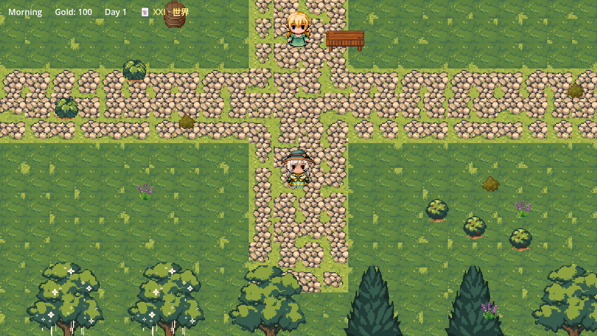
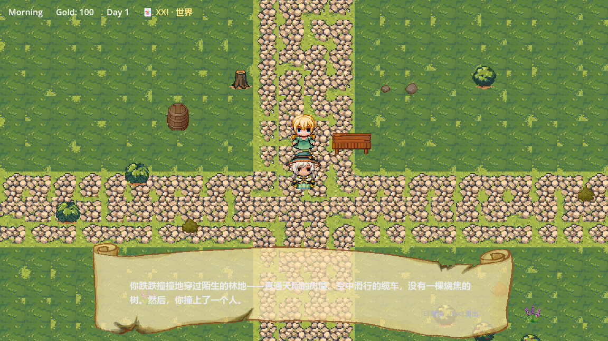
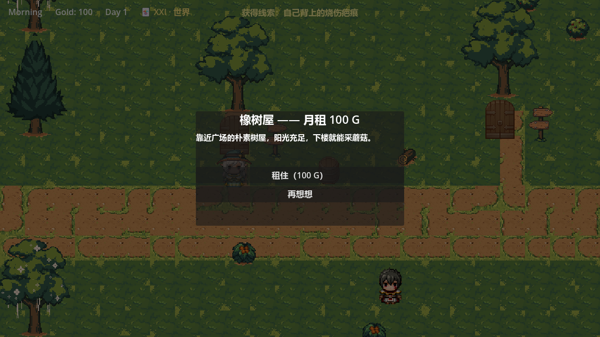
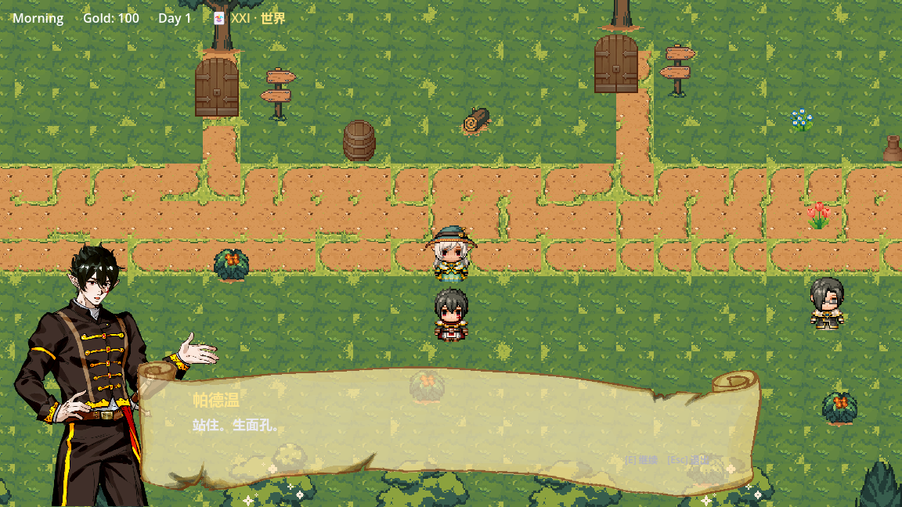
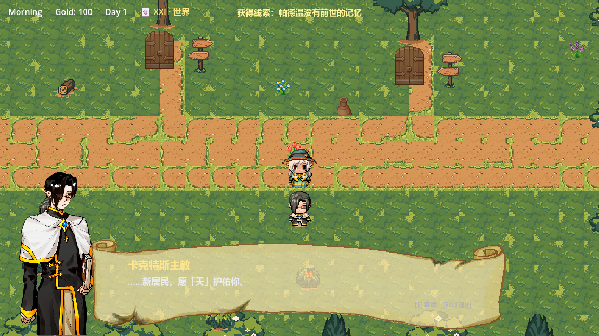
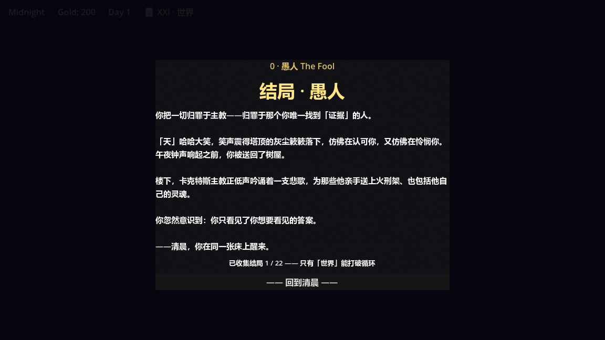

# 成为艾莉森的一天

> A Day as Alison —— AI 驱动的 2D 像素风叙事冒险游戏

<p align="center">
  
</p>

## 📖 项目简介

《成为艾莉森的一天》是一款由 **LLM 大语言模型驱动 NPC 对话**的 2D 像素风叙事游戏。

玩家扮演来到奇幻小镇"索拉雅"的旅人艾莉森，在一天的时间内与性格各异的 AI NPC 自由对话、探索场景、收集物品，体验一段由人工智能实时生成的独特叙事旅程。

**核心设计理念**：让 NPC 不再是复读机，而是能"记住"玩家、有情绪波动、会即兴发挥的真实角色。

---

## 🎮 游戏特色

### 1. AI 驱动的动态对话系统
- NPC 基于角色卡（Role Card）+ 实时 LLM 推理生成回复
- 支持自由输入式对话，不限于固定选项
- AI 不可用时自动回落本地 JSON 对话，保证游戏体验

<p align="center">
  
</p>

### 2. NPC 记忆与好感度系统
- NPC 会记住与玩家的对话历史
- 根据交互内容动态调整好感度档位
- 不同好感度解锁不同的对话分支和内容

### 3. 时间推进与昼夜循环
- 游戏内时间从清晨到深夜推进
- 不同时段触发不同事件和 NPC 行为
- 每日结束时进入"今日总结"结算

<p align="center">
  
</p>

### 4. 采集与物品系统
- 探索地图收集浆果、蘑菇等采集品
- 背包系统支持查看和管理物品
- 与 NPC 交易/赠送物品影响剧情走向

### 5. 塔罗日运系统
- 每日开局抽取塔罗牌，影响当日运势
- 运势泛化到采集、交易等多个 gameplay 维度

---

## 🏗️ 技术架构

| 层级 | 技术/方案 | 说明 |
|------|----------|------|
| 游戏引擎 | Godot 4.6 | 2D · GL Compatibility 渲染 |
| 编程语言 | GDScript | Godot 原生脚本语言 |
| AI 后端 | SiliconFlow API | DeepSeek-V3 模型，OpenAI 兼容协议 |
| 通信协议 | HTTPRequest ( threaded ) | 异步请求，避免阻塞主循环 |
| 数据格式 | JSON | 对话配置、物品数据、存档 |
| 场景管理 | Godot Scene Tree + Autoload | EventBus / GameManager / TimeManager |

### 核心系统模块

```
scripts/
├── autoload/
│   ├── ai_bridge.gd          # LLM 传输层（HTTP / mock / fallback）
│   ├── event_bus.gd          # 全局事件总线
│   ├── game_manager.gd       # 游戏状态管理
│   ├── inventory.gd          # 背包系统
│   └── time_manager.gd       # 时间推进系统
├── systems/
│   ├── ai_dialogue_session.gd    # AI 对话会话管理
│   ├── ai_heaven_session.gd      # 高塔/神谕对话系统
│   ├── heaven_memory.gd          # 天堂/记忆查询系统
│   ├── memory_query.gd           # NPC 记忆检索
│   ├── item_db.gd                # 物品数据库
│   └── scene_layout.gd           # 场景布局管理
├── npc/
│   └── npc_base.gd             # NPC 基类
├── ui/
│   ├── dialogue_ui.gd          # 对话界面
│   ├── inventory_panel.gd      # 背包面板
│   ├── sell_panel.gd           # 售卖面板
│   ├── status_panel.gd         # 状态面板
│   └── hud.gd                  #  HUD 主界面
└── player/
    └── player_controller.gd    # 玩家控制器
```

### AI 架构设计

```
玩家输入 → AIDialogueSession（prompt 组装）
                ↓
         AIBridge（HTTP 请求 LLM）
                ↓
         JSON Schema 校验 → 语义解析
                ↓
         NPC 回复 + 情绪标签 + 好感度变化
                ↓
         AIMemory（写入记忆）→ 影响后续对话
```

---

## 🚀 运行方式

### 环境要求
- Godot 4.6+ 编辑器
- （可选）SiliconFlow API Key —— 用于体验完整 AI 对话

### 步骤

1. 克隆仓库
   ```bash
   git clone <仓库地址>
   cd AIGameBuild/成为艾莉森的一天
   ```

2. 使用 Godot 4.6 打开项目
   ```bash
   godot --editor project.godot
   ```

3. 配置 AI（可选）
   - 在游戏开始界面输入 SiliconFlow API Key
   - 或设置环境变量 `SILICONFLOW_API_KEY`
   - 不配置则自动使用本地 JSON 对话（内容固定，体验降级）

4. 运行场景
   - 按 **F6** 运行当前场景，或按 **F5** 运行主场景

### 操作说明

| 按键 | 功能 |
|------|------|
| `W` `A` `S` `D` / 方向键 | 移动 |
| `E` / `Space` | 交互/确认 |
| `I` | 打开背包 |
| `T` | 推进时间 |
| `K` | 按键帮助面板 |
| `Tab` | 状态面板（天数/金币/塔罗/好感度） |

---

## 📁 项目结构

```
AIGameBuild/
├── 成为艾莉森的一天/          # Godot 项目根目录
│   ├── assets/                # 美术资源
│   │   ├── portraits/         # 角色立绘（表情差分）
│   │   ├── sprites/           # 精灵图
│   │   ├── tilesets/          # 瓦片地图素材
│   │   └── ui/                # UI 素材
│   ├── scenes/                # Godot 场景文件
│   │   ├── main.tscn          # 主场景
│   │   ├── player.tscn        # 玩家角色
│   │   ├── npc_*.tscn         # NPC 场景
│   │   └── ui/                # UI 场景
│   ├── scripts/               # GDScript 脚本
│   │   ├── autoload/          # 自动加载单例
│   │   ├── systems/           # 核心系统
│   │   ├── npc/               # NPC 逻辑
│   │   ├── player/            # 玩家逻辑
│   │   └── ui/                # UI 逻辑
│   ├── ai/                    # AI Prompt / 角色卡 / JSON Schema
│   ├── resources/             # Godot 资源文件（.tres）
│   ├── project.godot          # 项目配置
│   └── export_presets.cfg     # 导出配置
├── screenshots/               # 游戏截图
├── .gitignore
└── README.md
```

---

## 🎨 素材来源

| 素材 | 来源 | 许可证 |
|------|------|--------|
| 场景 tileset（草地/道路/建筑） | Cainos — *Pixel Art Top Down - Basic* | 免费商用，无需署名 |
| 场景 tileset（森林广场） |  itch.io 免费素材 | 免费商用 |
| 角色立绘（Alison / NPC 表情差分） | 项目原创 | — |
| 角色行走图 | 项目原创 | — |
| UI 元素（对话框/面板） | 项目原创 | — |

> ⚠️ 本项目中使用的第三方素材遵循其原始许可证。角色立绘与原创美术为项目资产，仅供学习参考。

---

## 🧪 测试

项目包含自动化测试覆盖核心系统：

```bash
# 在 Godot 编辑器中运行测试场景
res://scenes/autotest.tscn
```

当前测试覆盖：
- 物品采集与背包交互
- 售卖系统（整类卖出 / 部分卖出）
- 时间推进与事件触发
- UI 面板状态切换

---

## 📝 声明

本项目为**个人求职作品**，用于展示游戏策划与系统开发能力。

- 代码与原创素材开源，仅供学习参考
- 第三方素材遵循其原始许可证
- 本项目不提供任何形式的商业授权

---

## 📸 更多截图

<p align="center">
  
  
  
</p>

---

<p align="center">
  Made with ❤️ and ☕ in Godot 4.6
</p>
